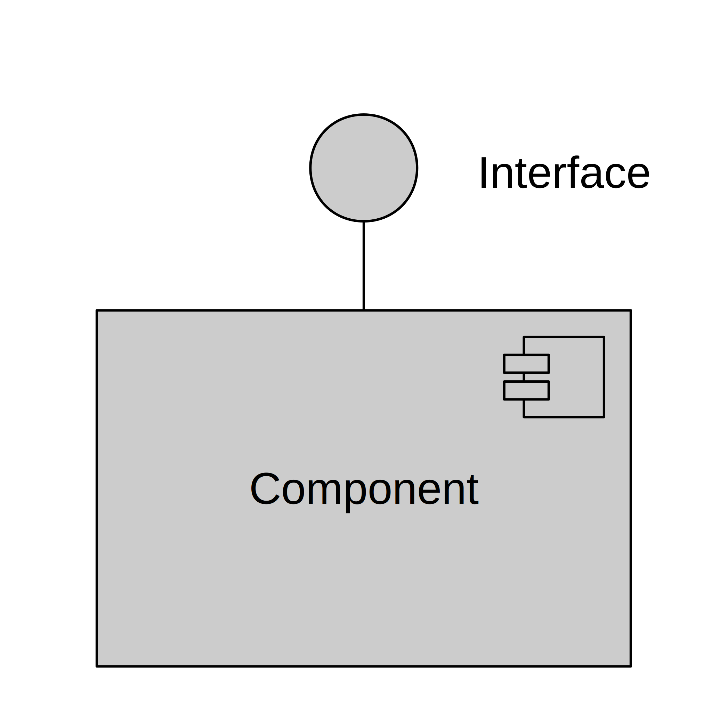

# Software Components

A component is a piece of source code[^2] with a specific purpose and an 
interface. All[^1] source code in your SW system should belong to a 
component.

The software components are the basic building blocks of a SW system. 

## Benefits

If you design good 
software components you will have the following benefits:

* More efficient troubleshooting and maintenance
* Less costly to improve and add functions to your system
* Easier to verify

The separation of software into components is for the benefit of the humans working with it.
The compute executiong the code doesn't care. Thus, to define a software component you
need to understand the limits of your fellow humans cognitive abilities.

The software components should be possible to be seen as a black box, for anyone only using it's 
functionality. That is when using the component you only need to know the purpose and the interface of the component.
Not the implementation. This reduces the cognitive load[^3] required to design and code a software system.

Also, when working with the component you don't need to know how the component is used. You only need to make sure
you fulfill the purpose and respect the interface.

## Component Purpose

The purpose of a software component *must* be clear.

It the purpose is not clear the component will be hard to use and hard to maintain.

In an embedded environment typical purposes of a components are:

* Controlling a device
* Handling input
* Handling a part of a MMI
* Handling some stored data

Or a component could provide services to other components:

* Logging
* Handling configuration parameters
* Scheduling
* Communication
* FFI
* PID regulation
* Encryption

A camera-equipped lawnmower robot for example could have components where the purposes are:

* Drive motor control
* Cutting motor control
* Map handling
* Trajectory planning

## Component Interface

The component interfaces are the *only* way it communicates with the surrounding system. 
There are many different types of interfaces. Or to put it differently, the component interface 
description must describe all the ways the component communicates with its environment.

### Function call interface

Let us start with the most common example: A function call interface provided by a component.

This kind of interface is supported by all common or less common languages for embedded SW
engineering: C, C++, Java, Rust.

In this interface the caller is outside the component, the callee is inside the component and 
the call is the interface. This kind of interface is so natural for most programmers that the
specifics of it is not really considered. So lets write them down:

* Function calls take place in one execution thread, the caller waits until the callee returns.
* It is bidirectional the caller provides data [^4] and the callee can return data [^5].
* Function call interfaces are asymmetric. There is a sender and receiver.

------

[^1] There are some exceptions. Generated code might only exist as 
temporary build files. The architectural framework might or might not
be a SW component of its own. See "bucket". 

[^2] The source code is the text files written by a human, intended 
to be read by a machine (a compiler, preprocessor, code generator etc)

[^3] Cognitive load is a nice expression for the amount of brain power needed for a 
task. See [https://en.wikipedia.org/wiki/Cognitive_load]. When the cognitive load exceeds your limit
things start to get slower in a non-linear way.

[^4] Even if the caller does not explicitly provides data as parameters to the call, it provides
the call adress, which indicates what is expected to be done.

